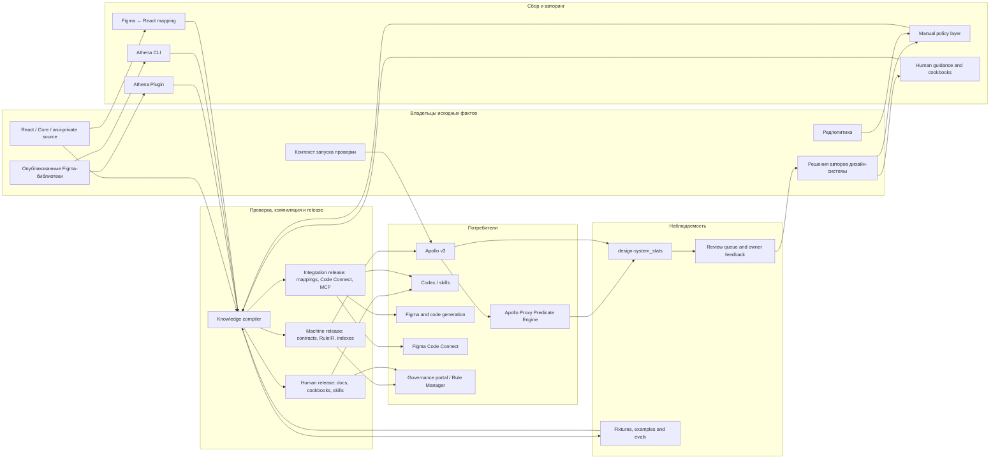
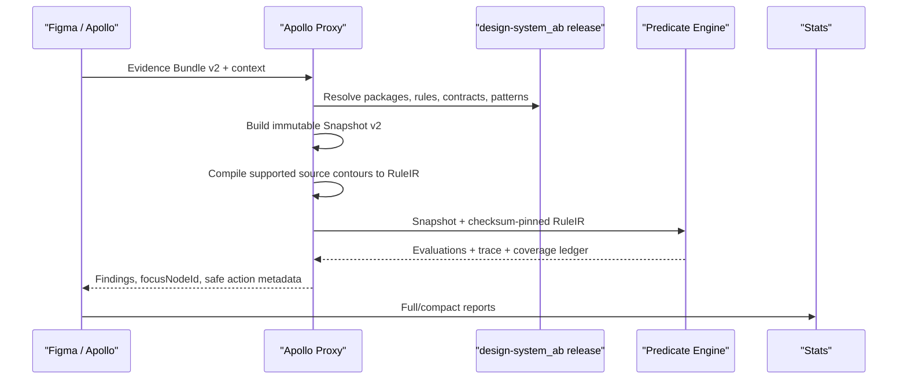
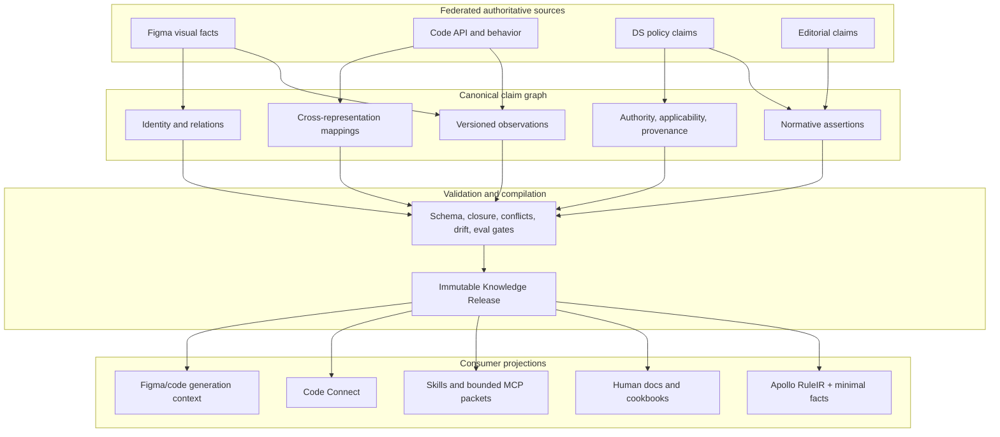

# Архитектура экосистемы знаний DS AB

Статус: архитектурная карта текущего состояния и целевой модели  
Дата: 2026-08-28  
Область: Figma, React, `design-system_ab`, `ds-ai-hub`,
`arui-private-ai-hub`, Apollo, Athena и связанные инструменты

## 1. Главный вывод

У экосистемы не может быть одного репозитория — «источника истины» для всех
видов знаний. Истина федеративна и определяется типом факта:

- Figma-библиотека владеет опубликованной визуальной структурой, вариантами,
  ключами и текущим состоянием компонента;
- React/Core-код владеет программным API, типами, поведением и ограничениями
  реализации;
- авторы дизайн-системы владеют нормативными решениями: что разрешено,
  запрещено, обязательно и в каком контексте;
- редакционная команда владеет правилами текста;
- пользователь проверки владеет контекстом конкретного запуска: платформой,
  типом страницы и проверяемой областью;
- release знаний владеет только замороженной, проверенной проекцией этих
  источников на конкретный момент времени.

Следовательно, объединяющим элементом должен стать не один общий Markdown или
JSON, а единый **контракт происхождения знания**:

1. кто владеет исходным фактом;
2. как он был получен;
3. кем и когда подтверждён;
4. в каких условиях применим;
5. в какую проекцию скомпилирован;
6. каким потребителем и какой версией исполнен.

`design-system_ab`, `ds-ai-hub` и `arui-private-ai-hub` в этой модели не
конкурируют за роль единого источника. Они публикуют разные проекции одного
графа знаний.

## 2. Термины, которые нельзя смешивать

| Термин | Значение |
|---|---|
| Источник факта | Система или владелец, где факт возникает: Figma, код, автор ДС, редактор |
| Авторский источник | Файл, в котором вручную редактируется смысл или политика |
| Наблюдение | Снятое состояние источника без нормативного вывода |
| Нормативное утверждение | Проверенное правило с областью применимости и authority |
| Проекция | Представление знания под конкретного потребителя: Markdown, RuleIR, Code Connect, MCP packet |
| Компилированный release | Неизменяемый набор проекций с версиями и checksum |
| Runtime evidence | Факты конкретного макета, собранные во время проверки |
| Verdict | Результат исполнения правила над runtime evidence |
| Отчёт/телеметрия | След уже выполненной проверки; он не является правилом |

Критическое различие: **файл, который потребляет runtime, не обязательно
является авторским источником**. Например, RuleIR — канонический исполняемый
release, но редактировать его вручную нельзя.

## 3. Общая карта системы



На схеме `Knowledge compiler` — целевая логическая роль. Сегодня она разделена
между Athena, Athena CLI, скриптами `design-system_ab`, `ds-ai-hub` и release
loader Apollo Proxy.

### 3.1 Количественный срез текущего состояния

| Слой | Фактический объём на 2026-08-28 | Что это означает |
|---|---:|---|
| `design-system_ab/JSONS` | около 808 MB | Это одновременно authoring tree и тяжёлый runtime delivery |
| Raw component catalogs | 322 файла, около 545 MB | Основной объём создают наблюдения Figma |
| Component packages | 153 directories, 151 indexed packages | Физическое наличие package не равно нормативной готовности |
| Package rule status | 31 ready, 7 draft, 115 generated-draft | Большинство packages пока содержит generated scaffold |
| `componentContractIndex` | 151 packages, 14 605 key lookups, 1 954 aliases | Главная точка lazy routing contracts |
| `ds-ai-hub` registry | 630 knowledge units | Самый широкий human/agent knowledge layer |
| AB в `ds-ai-hub` | 49 components, 34 patterns, 30 cookbook packages | Human coverage значительно шире executable coverage |
| Verified AB knowledge | 31 Figma-verified, 19 code-verified | Figma и code readiness — независимые оси |
| `arui-private-ai-hub` mappings | 6 packages, только 4 непустых | 2,6% indexed packages имеют содержательную JSON mapping |
| `arui-figma-connector` | 3 React components, 4 connects | Code Connect остаётся PoC |
| Embedded Proxy knowledge | 151 packages, 1 057 artifacts, около 199 MB contract data | Distributed app сегодня поставляет слишком широкий snapshot |

В `ds-ai-hub` 34 AB patterns содержат примерно 598 Rule-блоков. В
`design-system_ab` те же 34 pattern names представлены отдельными файлами, но
ни одна пара не совпадает побайтово. Найдены rule IDs, существующие только в
одном из двух репозиториев, поэтому это уже drift, а не просто разные стили
изложения.

## 4. Источники истины по типу факта

| Тип факта | Владелец | Runtime-истина для Apollo | Что делать при расхождении |
|---|---|---|---|
| Figma key, варианты, дерево и визуальные значения | Опубликованная Figma-библиотека | Последний проверенный snapshot release в `design-system_ab` | Не угадывать «более новую» версию; создать review для владельца ДС |
| Effective baseline компонента | Верифицированный Figma snapshot + выбранная variant chain | `contract.generated.json` и связанные каталоги release | `unknown`, если provenance baseline отсутствует |
| React props, типы и поведение | Исходный код и опубликованный пакет | Версионированная code projection | Обновить mapping/bridge, не исправлять дизайн-правило |
| Разрешённые/запрещённые кастомизации | Авторы ДС | Active rule с authority и revision | Без active authority нарушение не подтверждается |
| Композиция и вложенное ownership | Авторы ДС, подтверждённые структурой | Active composition contract / contour | При неполных фактах — `not-evaluable` |
| Паттерн страницы | Авторы паттерна | Active executable contour + выбранный `pageType` | Без типа страницы не исполнять только специализированную часть |
| Редполитика | Редакционная команда | Версионированные text rules | Семантические случаи передавать агенту или человеку |
| Lifecycle и replacement | Владелец библиотеки/ДС | Release lifecycle + отдельная таблица замен | Не выводить замену из похожего имени |
| Figma ↔ React соответствие | Совместно DS + code owner | Проверенная mapping projection | Отмечать неполное coverage и drift |
| Факт конкретного макета | Apollo/Figma Plugin API | Immutable Predicate Snapshot v2 | Отсутствие факта означает `unknown`, а не нарушение |
| Контекст страницы | Дизайнер в одном запуске | `pageType`, platform, selection context | Не переносить выбор между проверками |

Для Apollo канонична не произвольная «самая свежая» Figma-нода, а последний
проверенный release effective baseline. Это защищает аудит от ситуации, когда
компонент обновлён, а пакет знаний ещё не пересобран.

## 5. Типы данных и знаний

### 5.1 Механические наблюдения

Получаются автоматически и не содержат продуктового решения:

- raw component catalogs из Figma;
- component/page indexes;
- Figma component keys и variant keys;
- структуры узлов, свойства, размеры, токены и стили;
- resolved aliases и actual token values;
- generated component contracts;
- code API, извлечённый из типов и исходников;
- runtime snapshot выбранной области.

Главное правило: генератор может восстановить наблюдение, но не имеет права
самостоятельно объявить его обязательным.

### 5.2 Нормативные знания

Описывают ожидаемое состояние и требуют owner authority:

- `rules.json` manual layer;
- `composition-contract.json` manual contracts;
- executable contour в component rule или pattern;
- lifecycle/replacement policy;
- паттерны страницы и компонентов;
- redpolicy rules;
- исключения и делегирование другому owner contract.

Минимальная identity исполняемого утверждения:

```text
ruleId + revision + authority + applicability + source checksum
```

### 5.3 Человекочитаемые знания

Помогают понять «зачем» и «как проектировать»:

- `instructions.md`, `guidelines.md`;
- component/pattern documents;
- cookbooks и пошаговые рецепты;
- `bridge.md` с текущими расхождениями Figma и code;
- do/don't, troubleshooting и migration guidance.

Они не должны быть вторым независимым местом хранения точного predicate.
Человекочитаемый документ обязан ссылаться на canonical `ruleId`, а CI —
проверять, что его формулировка не противоречит машинному эффекту.

### 5.4 Процедурные знания агента

- skills;
- prompts и workflow;
- инструкции выбора источников;
- правила безопасного применения инструментов;
- формат ответа и последовательность проверки.

Skill отвечает на вопрос **как выполнить работу**, но не должен дублировать
внутри себя все component rules.

### 5.5 Межсистемные mappings

- Figma component key ↔ canonical component identity;
- Figma property/value ↔ React prop/value;
- Figma slot ↔ React child/prop;
- token/variable ↔ code token;
- component identity ↔ package/export/import;
- pattern/component ↔ applicable skill/cookbook.

Это самостоятельный контракт. Он не является ни design rule, ни prose
documentation.

### 5.6 Примеры и evals

- PASS/FAIL/UNKNOWN/NOT-APPLICABLE fixtures;
- Figma test sections;
- `examples.json`;
- cookbook examples;
- generation and validation evals;
- round-trip Figma ↔ React tests.

Пример доказывает работоспособность правила, но не порождает правило.

### 5.7 Runtime evidence и результаты

- Apollo Audit Evidence Bundle v2;
- Predicate Snapshot v2;
- RuleIR release;
- predicate trace;
- coverage ledger;
- findings, focus node и action id;
- полный, agent и WIP отчёты;
- debug run packets.

Эти данные привязаны к `auditId`, `snapshotHash` и release checksum. Их нельзя
использовать как нормативный источник без review и нового revision.

### 5.8 Governance и телеметрия

- manifests, checksums и publication receipts;
- CODEOWNERS/approval;
- package coverage и rule closure;
- статистика срабатываний;
- review queue и ссылки в Figma;
- drift diagnostics.

## 6. Значение каждого репозитория и инструмента

| Элемент | Текущая роль | Не является | Целевая роль |
|---|---|---|---|
| Figma libraries | Origin визуальных фактов | Источником code behavior | Версионируемый upstream с receipt |
| `projects/figma-plugins/Athena` | Plugin API exporter компонентов, variables и styles; публикация в GitHub | Автором продуктовой политики | Точный Figma-native collector |
| `projects/Athena CLI` | REST collector, normalizer, contract builder, validator и publisher | Заменой Plugin API там, где REST неполон | Headless compiler/release orchestrator |
| `services/figma-automation-runner` | Управляет Figma branches и запуском Athena | Хранилищем знаний | Автоматизация воспроизводимого capture/release |
| `shared/design-system_ab` | Runtime release: catalogs, indexes, generated evidence, manual rules, patterns, redpolicy | Единственным источником всех смыслов | Machine knowledge release и manual policy source |
| `ds-ai-hub` | Human/agent knowledge: instructions, guidelines, cookbooks, adapters, skills, evals | Вторым runtime rule engine | Human projection и workflow layer |
| `arui-private-ai-hub` | Ранний MCP и Figma↔React mapping prototype, skills, token snapshot | Новым нормативным источником | Integration facade над проверенным release |
| `arui-figma-connector` | Figma Code Connect templates для отдельных React components | Каноническим хранилищем mapping-логики | Генерируемая Code Connect projection |
| `projects/Apollo-v3` | Сбор runtime evidence, детерминированные component checks, UI, focus/actions, отчёты | Владельцем design rules | Thin audit client и evidence collector |
| `services/apollo-proxy` | Security boundary, release loader, RuleIR compiler, Predicate Engine, Codex launcher | Источником компонентной политики | Stateless execution gateway |
| `ApolloProxyControl.app` | Упаковка proxy, Codex auth и локального knowledge snapshot | Live-синхронизацией GitHub | Версионированный desktop distribution |
| Codex + Apollo skill | Семантическая интерпретация, text review, объяснение | Автором deterministic verdict | Semantic worker поверх bounded evidence |
| `arui-private-ai-hub/mcp-server` | Прототип search/API/pattern/token tools | Production evaluator Apollo | Унифицированный read-only knowledge API после hardening |
| `services/rule-manager` | Визуальный graph/rules prototype | Runtime source | Authoring/review UI над canonical claims |
| `services/ds-governance-portal` | Метрики, previews и read-only file browsing MVP | Production approval workflow сегодня | Governance, ownership, drift и review UI |
| `shared/design-system_stats` | Immutable reports/telemetry history | Базой правил | Analytics and evaluation corpus |
| Supabase Apollo Stats function | Безопасная идемпотентная доставка reports в GitHub | Обработчиком verdict | Production telemetry transport |
| `services/apollo-stats-collector` | Локальный debug transport | Production path | Только dev fallback |
| `projects/figma-plugins/Argus` | Text transformations + LangFlow result | Общим redpolicy compiler | Consumer общего editorial release |
| `projects/figma-plugins/TextGrabber` | Извлечение текстового JSON для Confluence/RAG | Валидатором компонентов | Evidence producer для editorial knowledge |
| Proteus и прочие узкие plugins | Операционные Figma-задачи | Частью knowledge authority | Периферийные consumers/producers по явному контракту |

### 6.1 Текущая проблема двух Athena

Athena Plugin и Athena CLI сегодня не только извлекают данные разными API, но
и частично выполняют одну и ту же компиляционную и публикационную работу:

| Операция | Athena Plugin | Athena CLI |
|---|---|---|
| Figma extraction | Plugin API, наиболее полные variables/styles | REST, пригоден для headless component capture |
| Package generation | Частичный schema-v1/compatibility output | Ownership schema v2 + public compiler |
| Component indexes | Генерирует самостоятельно | Генерирует самостоятельно |
| Rules registries | Обновляет самостоятельно | Компилирует самостоятельно |
| Publication | Последовательность GitHub Contents API PUT | Staging, receipt, один scoped commit, remote hash verification |

Это наиболее опасное дублирование в текущей системе. Целевая граница:

- Athena Plugin и REST extractor производят только capture artifacts;
- один Athena compiler собирает package/release;
- только Athena CLI/release service публикует атомарный release;
- plugin publisher остаётся preview/dev transport до отключения.

## 7. Что находится в `design-system_ab`

### 7.1 Raw и routing layer

- `JSONS/referenceSourcesMVP.json` — bootstrap и маршрутизация каталогов;
- page/component catalogs — Figma snapshot по библиотеке/странице;
- `*.index.json` — lazy resolution component keys;
- token/style catalogs;
- `JSONS/apollo/indexes/componentContractIndex.json` — routing package по
  canonical identity и Figma keys.

### 7.2 Component package

Сейчас типовой package повторяет семь артефактов:

- `contract.generated.json` — generated Figma/API evidence;
- `contract.overrides.json` — ручные поправки к generated contract;
- `rules.json` — generated observations + manual normative rules;
- `composition-contract.json` — ownership, slots и relational constraints;
- `agent-context.json` — контекст для agent projection;
- `audit-mapping.json` — представление/маршрутизация аудита;
- `examples.json` — примеры и eval candidates.

Не все семь нужны каждому runtime-запросу. Их следует считать authoring
modules, а не обязательным transport packet. Для Predicate Engine минимальный
release обычно состоит из:

```text
identity/index
+ generated facts needed by selected rules
+ active rules/composition
+ presentation/remediation references
+ checksums and coverage
```

`agent-context`, `audit-mapping`, `examples` и overrides могут оставаться
полезными исходниками, но должны попадать только в соответствующую consumer
projection. Пустые шаблоны не должны публиковаться как доказательство coverage.

### 7.3 Global Apollo layer

- capability registries и schemas;
- audit policies;
- remediation/replacement data;
- package/rule registries;
- pattern rule indexes;
- experimental/compiled component contracts.

### 7.4 Patterns и redpolicy

- `patterns/p_*.md` совмещают human narrative и отдельные executable contour
  blocks;
- `redpolrules/*` содержит глобальные и LLM-context редакционные правила.

Смешанный Markdown допустим как authoring UX, только если executable block
валидируется как структурированное утверждение, имеет stable `ruleId` и не
дублируется в component package.

## 8. Что находится в `ds-ai-hub`

`ds-ai-hub` — зрелее всего как контракт человекочитаемой базы знаний:

- product AB compact packages: `meta.json`, `figma-keys.json`,
  `instructions.md`;
- более полные Core packages: guidelines, Figma/code adapters, bridge,
  cookbook, snippets, models и keys;
- product patterns;
- skills для design, review, editorial, implementation и learning;
- registry/wiring под разные агенты;
- schemas, linters, governance checks и evals.

Его сильная сторона — контекст, объяснения и workflow. Слабое место текущей
архитектуры — параллельное ручное хранение части точных правил и pattern text,
которые уже менялись в `design-system_ab` во время разработки Predicate Engine.

Целевая граница:

- `ds-ai-hub` вручную хранит narrative, rationale, cookbook и workflow;
- точные rule effects, domains и applicability приходят из canonical claim
  release;
- CI проверяет ссылки `ruleId`, coverage и смысловые расхождения;
- agent получает только релевантный bounded projection, а не весь репозиторий.

## 9. Что добавляют `arui-private-ai-hub` и Code Connect

### 9.1 `arui-private-ai-hub`

Репозиторий формулирует правильную интеграционную задачу: дать агенту доступ к
component API, паттернам, lifecycle, tokens и Figma↔React mapping через MCP и
skills. Текущая реализация остаётся прототипом:

- mapping есть только для небольшой части компонентов;
- loader не использует полный `componentContractIndex`;
- lifecycle/replacement и token tools частично заглушены;
- validate-composition не исполняет RuleIR Apollo;
- документация опережает runtime.

Поэтому MCP не должен создавать второй интерпретатор правил. Он должен читать
те же compiled releases, что Apollo, и отдавать:

- component discovery/API;
- human guidance;
- React mapping;
- bounded validation/generation context;
- provenance и coverage.

### 9.2 `arui-figma-connector`

Code Connect files сегодня вручную описывают соответствие Figma properties и
React props. Это полезная delivery projection, но mapping уже начинает
дублироваться с `figma-props-map.json`.

Целевой поток:

```text
canonical Figma ↔ React mapping
  -> schema validation and round-trip eval
  -> figma-props-map projection for MCP/generation
  -> .figma.tsx projection for Code Connect
```

Mapping должен включать componentId/mappingId, Figma keys, React import/export,
prop/value transforms, slots/children, applicability, source versions,
checksums и coverage.

## 10. Как работает Apollo сейчас

### 10.1 Component audit в плагине

1. Apollo получает один selection root и выбранный page context.
2. Загружает remote manifest, token/style catalogs и indexes.
3. Лениво разрешает найденные component keys.
4. Строит actual snapshot и effective baseline diffs.
5. Выполняет существующие детерминированные проверки компонентов.
6. Формирует Evidence Bundle v2 для Predicate Engine.
7. Рендерит findings, фокусирует точный node и выполняет только безопасные
   зарегистрированные действия после решения пользователя.

### 10.2 Pattern audit в новом predicate path



В этом пути LLM не вычисляет verdict. Движок использует трёхзначную логику:
`true | false | unknown` и отдельно applicability. Агент в будущем может
сгруппировать или объяснить уже готовые findings, но не менять classification.

Текущее важное ограничение: kernel и contour registry уже универсальны, но
release loader ещё содержит migration/bootstrap-ссылки на первые пилотные
packages и patterns. Это переходный слой, а не целевая архитектура. Он должен
уступить место полностью index-driven discovery после закрытия package
migration gates.

Кроме loader constants, Snapshot Adapter пока содержит предметные enrichers
для нескольких первых families и form relations. Универсальность будет
доказана только тогда, когда новый component/pattern подключается через
capabilities, source contours и fact requirements без новой ветки по имени в
adapter/runtime.

### 10.3 Text audit и чат

Текстовые и genuinely semantic задачи пока могут запускать Codex. Proxy:

- подготавливает bounded packet;
- запускает отдельный read-only ephemeral agent run;
- валидирует schema, evidence paths и safe actions;
- не передаёт секреты процессу Codex.

При distributed `ApolloProxyControl.app` агент читает knowledge snapshot,
включённый в сборку приложения. Это не live checkout и не автоматическое чтение
последнего GitHub commit. В dev-режиме proxy может использовать явно заданные
`CODEX_DS_AI_HUB` и `CODEX_DESIGN_SYSTEM` локальные пути.

Следствие: свежесть agent chat и свежесть remote Apollo catalogs сегодня имеют
разные release-механизмы. Это необходимо показывать в health/version UI.

Свободный Codex-chat также не получает автоматически текущие selection,
finding или audit report: сейчас ему передаются вопрос, ограниченная история и
один выбранный knowledge root. Поэтому chat не следует трактовать как
продолжение конкретной проверки, пока context handoff не станет явным.

### 10.4 Кто сегодня принимает решение

| Контур | Decision maker | Knowledge source |
|---|---|---|
| Components/base audit | Детерминированный Apollo plugin | Remote catalogs, indexes и contracts |
| Patterns tab | Predicate Engine без LLM | Baked/local `design-system_ab` release |
| WIP customization review | Codex | Prepared proxy packet |
| Texts tab | Codex | Redpolicy + selected pattern/component text rules |
| Apollo v2 legacy audit | Codex skill | Snapshot + PNG + embedded/local knowledge |
| Codex chat | Codex | Один выбранный embedded/local root |
| LangFlow chat | Внешний agent flow | External service context |
| Focus/reset/bind/replace | Детерминированный plugin action registry | Exact node/action evidence |

Новый pattern predicate path и старые agent paths существуют параллельно.
Документация должна явно помечать их как `current`, `legacy`, `A/B` или
`planned`, иначе создаётся впечатление, что агент всё ещё участвует в
pattern-verdict.

## 11. Ключи, связывающие систему

| Объект | Стабильная identity | Нельзя использовать как primary key |
|---|---|---|
| Knowledge component | `web-corp.title-view` и аналогичный namespaced id | Отображаемое имя `[D] TitleView` |
| Figma component | published component/component-set key + variant key | Node id из конкретного документа |
| Package | canonical component id + package path + release checksum | Имя папки без index |
| Rule | `ruleId + revision + source checksum` | Текст правила |
| Pattern | namespaced pattern id + rule ids | Название Markdown-файла |
| Runtime node | `fileKey + nodeId + snapshotHash` | Имя слоя |
| Audit | `auditId + snapshotHash + ruleRelease` | Время запуска |
| React component | package + export/import + package version | Похожее display name |
| Mapping | stable mappingId + Figma key + code export revisions | Одна `.figma.tsx` path |
| Token | variable key/id + collection + mode | RGB/HEX без provenance |

Все cross-repo joins должны проходить по этим identity. Name matching остаётся
только диагностическим fallback и не может подтверждать нарушение.

## 12. Общие точки существующих систем

Несмотря на различия форматов, все четыре knowledge-направления уже сходятся на
одной модели:

1. **Identity** — компонент, правило, слой и источник должны иметь стабильный id.
2. **Context** — platform, page type, variant, slot и owner меняют применимость.
3. **Authority** — generated факт и manual policy имеют разные полномочия.
4. **Evidence** — решение должно ссылаться на наблюдаемый факт и источник.
5. **Projection** — одному факту нужны разные формы для человека, движка и codegen.
6. **Coverage** — неизвестное знание должно быть видимым, а не превращаться в догадку.
7. **Versioning** — source revision, checksum и release должны проходить до отчёта.
8. **Evaluation** — примеры и реальные reports нужны для проверки качества release.

Именно эти восемь полей должны стать общим контрактом, а не конкретная текущая
структура одного JSON-файла.

## 13. Основные расхождения и дубли

### 13.1 Human rules и executable rules расходятся

Во время миграции Predicate Engine точные component rules менялись в
`design-system_ab`, а соответствующие instructions/patterns в `ds-ai-hub`
обновлялись не всегда. Это не проблема Markdown как формата; это отсутствие
автоматической связи по `ruleId`.

### 13.2 Один package публикует слишком много одинаковых оболочек

Сотни packages содержат одинаковый набор из семи JSON-файлов независимо от
реального наполнения. Это удобно для шаблона, но создаёт ложное ощущение полной
готовности. Нужен manifest capabilities: публиковать артефакт только если он
имеет owner, содержание и consumer.

### 13.3 Паттерны зеркалируются

`design-system_ab/patterns` и `ds-ai-hub/products/ab/patterns` хранят близкий
текст. Один из них должен стать authoring source, второй — проверенной
проекцией либо осознанно более подробным narrative с теми же rule references.

### 13.4 Два формата Figma ↔ React mapping

`figma-props-map.json` и ручные Code Connect `.figma.tsx` описывают один тип
соответствия, но не собираются из общей модели.

### 13.5 Skills дублируются между репозиториями

Копии skills полезны для distribution, но каноническая версия должна иметь
одного владельца, а остальные копии — checksum и generated notice.

### 13.6 MCP создаёт риск второго rule engine

Если `arui-private-ai-hub` начнёт самостоятельно трактовать prose/rules, Apollo
и MCP будут давать разные verdict. MCP должен вызывать общий evaluator или
возвращать compiled claims, а не поддерживать собственную семантику операторов.

### 13.7 Remote и baked knowledge обновляются по-разному

- Apollo plugin читает remote `design-system_ab/main` с cache-busting;
- Predicate Proxy читает локальный/packaged release;
- Codex chat в distributed app читает baked snapshot;
- Code Connect и MCP имеют отдельные публикации.

Без общего `knowledgeReleaseId` пользователь не видит, почему два инструмента
ответили по-разному.

Фактический default bootstrap Apollo Plugin сейчас закреплён на GitHub Pages,
тогда как часть workspace/CLI-документации описывает `raw.githubusercontent.com`
как production transport. Это нужно привести к одному проверяемому delivery
contract, а не оставлять как спор README.

### 13.8 Универсальный engine и pilot loader находятся на разных стадиях

Predicate algebra и contour builders component-independent, но discovery
частично закреплён константами первых migrated packages. Это нормальный этап
миграции, но его нельзя выдавать за полную универсальность.

### 13.9 Telemetry пока не замыкает governance loop

Reports сохраняются надёжно, но автоматический путь
`неоценимый факт → review owner → новый revision → regression fixture` ещё не
является единым workflow.

### 13.10 Документация иногда описывает целевую модель как уже реализованную

Особенно это видно в раннем MCP и старых README. Для каждой возможности нужен
статус `implemented | partial | planned` и ссылка на executable test.

### 13.11 Stats покрывают не все agent outputs

Production outbox отправляет full, compact agent-input, WIP и predicate reports,
но не сохраняет возвращённый Codex customization review, text audit output и
chat messages. Это разумно с точки зрения приватности, но analytics не должна
ошибочно считать stats полным журналом всех agent decisions.

### 13.12 Подтверждённый drift register

| Расхождение | Состояние | Архитектурная причина |
|---|---|---|
| `TitleStatus` в TitleView | Human docs допускают standalone, executable rule требует `Status=true` в применимой конфигурации | Narrative и executable policy редактируются независимо |
| 34 зеркальных AB patterns | Ни одна пара файлов не идентична; 22 rule IDs есть только в `ds-ai-hub`, 5 — только в `design-system_ab` | Нет canonical pattern claim source и projection build |
| `ds-ai-hub/products/ab/manifest.json` | Закреплён на более старый `design-system_ab` SHA; большинство patterns не содержит собственного `syncedFromSourceSha` | Release provenance не проходит до human docs |
| BackgroundPlate Figma↔React | JSON mapping считает `modal-bg*` unmapped, Code Connect переводит их в `base-bg*` | Два ручных mapping source |
| MCP component status | Loader читает устаревшее поле/ограниченный набор package paths и возвращает `unknown` | MCP не использует canonical package index/schema |
| `patternRules copy.json` | Не входит в bootstrap и содержит иной набор rules | Неуправляемая параллельная копия |
| Orphan package directories | Физически существуют, но не входят в `componentContractIndex` либо конфликтуют по identity | Storage inventory не равен release inventory |
| Rule Manager data root | Один из build scripts всё ещё ожидает старый `shared/assets/design-system_ab` | Инструмент не привязан к release manifest |
| README package/pattern counts | В нескольких репозиториях отстают от фактических индексов | Документация считает файлы вручную вместо generated metrics |

Этот register должен стать машинно проверяемым release report, а не постоянно
обновляемым вручную разделом документа.

## 14. Целевая архитектура



### 14.1 Canonical claim

Минимальная общая запись должна уметь представить:

```json
{
  "claimId": "component:web-corp.title-view.title-color-fixed",
  "kind": "normative-constraint",
  "subject": "web-corp.title-view",
  "authority": {
    "owner": "design-system-authors",
    "status": "active",
    "revision": 2
  },
  "applicability": {
    "platform": ["desktop", "mobile-web"]
  },
  "source": {
    "path": ".../rules.json",
    "checksum": "..."
  },
  "machine": {
    "contour": "baseline",
    "fact": "appearance.fill.value"
  },
  "human": {
    "summary": "Цвет Title и Subtitle задаётся компонентом"
  },
  "relations": {
    "tests": ["..."],
    "docs": ["..."],
    "mappings": []
  }
}
```

Это логическая модель. Она может храниться несколькими файлами, если build
доказывает единство identity, revision и effect.

### 14.2 Consumer projections

| Consumer | Что получает | Чего не получает |
|---|---|---|
| Apollo Predicate Engine | RuleIR + только запрошенные facts + presentation | Полные raw catalogs и prose |
| Apollo component audit | Indexes, token/style lookup, generated baselines, safe action metadata | Agent instructions |
| Codex text/chat | Bounded human docs, semantic rules, provenance, selected evidence | Все packages и право менять deterministic verdict |
| Figma generator | Component identities, slots, allowed APIs, recipes, mappings | Audit telemetry пользователей |
| React generator | Code API, tokens, patterns, Figma mapping | Plugin-only node internals |
| Code Connect | Generated mapping templates | Нормативные audit rules, если они не влияют на mapping |
| Human docs | Narrative, rationale, examples, rule references | Internal RuleIR trace |
| Governance UI | Claims, owners, drift, coverage, reports | Секреты и локальные debug packets |

## 15. Release и freshness contract

Каждая projection должна публиковать один общий header:

```text
knowledgeReleaseId
source revisions
generatedAt
compilerVersion
schema versions
artifact checksums
coverage summary
```

Потребитель обязан показывать этот release id в health/debug. Запрещено
«склеивать» artifacts разных releases без явного compatibility gate.

Distributed ApolloProxyControl должен уметь отдельно показать:

- Predicate release;
- baked agent knowledge release;
- Apollo plugin remote catalog release;
- skill version/checksum.

## 16. Governance invariants

1. Один exact constraint исполняется ровно одним canonical rule.
2. Generated data не получает manual authority автоматически.
3. Prose не добавляет скрытый predicate.
4. Missing evidence даёт `unknown/not-evaluable`.
5. Agent не повышает и не понижает deterministic finding.
6. Every violation содержит exact focus node и source revision.
7. Mapping и component rule — разные claim kinds.
8. Любая копия skill/doc/mapping знает canonical source и checksum.
9. Публикация блокируется при missing closure, conflict или stale projection.
10. Report никогда не становится правилом без owner review и нового revision.
11. Скрытые слои исключаются из обычного audit, кроме явно запрошенного
    composition evidence.
12. Пользовательское исправление всегда начинается с решения пользователя.

## 17. Что оставить, объединить и вывести из runtime

### Оставить как канонические inputs

- raw Figma catalogs и indexes;
- verified generated contracts;
- active manual rules/composition;
- token/style catalogs;
- pattern and editorial claims;
- React API source projection;
- canonical Figma↔React mapping;
- authority, coverage, checksums и receipts.

### Объединить через общий claim id

- component rules и human component instructions;
- executable pattern blocks и human pattern text;
- `figma-props-map` и Code Connect templates;
- lifecycle и replacement mapping;
- duplicated skills;
- examples и regression fixtures.

### Не включать во все runtime packets

- полные raw catalogs, если нужны только несколько facts;
- пустые `agent-context/audit-mapping/examples` templates;
- prose, не относящийся к выбранному rule/fact;
- debug traces другого audit;
- telemetry и пользовательские тексты в generation context;
- duplicated compatibility projections после завершения migration.

## 18. Рекомендуемая последовательность перехода

### P0 — единая инвентаризация и release identity

1. Ввести `knowledgeReleaseId` для всех compiled artifacts.
2. Построить inventory claim → source → projection → consumer.
3. Явно пометить каждый artifact как `authored`, `generated`, `compiled`,
   `delivery` или `telemetry`.
4. Добавить статус реализации в MCP/portal/docs.

### P1 — закрыть drift human ↔ machine

1. Связать human docs с `ruleId`.
2. Сделать semantic drift check для уже migrated компонентов.
3. Выбрать один authoring source для зеркальных patterns.
4. Генерировать rule summary/source links в human projection.

### P2 — сделать package publication потребительской

1. Ввести package capabilities manifest.
2. Не публиковать пустые оболочки как required runtime artifacts.
3. Компилировать отдельные bundles: Apollo, agent, docs, generation, mapping.
4. Пересмотреть генерацию Athena/Athena CLI и сохранение manual layer.

### P3 — унифицировать Figma ↔ React bridge

1. Утвердить mapping schema и владельцев.
2. Перенести текущие карты и `.figma.tsx` в один source model.
3. Генерировать обе projection.
4. Добавить coverage и round-trip tests.

### P4 — один evaluator для Apollo и MCP

1. Убрать самостоятельную rule semantics из MCP.
2. Перевести release discovery proxy с pilot constants на indexes/capabilities.
3. Экспортировать read-only evaluation API.
4. Оставить agent layer для explanation, text и genuinely semantic review.

### P5 — замкнуть governance loop

1. `not-evaluable` и frequent findings автоматически группируются по rule/fact.
2. Владелец получает Figma link, evidence и release id.
3. Исправление знания создаёт revision и fixture.
4. CI прогоняет Apollo, human projection, MCP и mapping gates вместе.

## 19. Критерий успешной архитектуры

Архитектура считается объединённой, когда один факт можно проследить по полной
цепочке:

```text
владелец факта
  -> authored/generated source
  -> reviewed claim
  -> immutable release
  -> consumer projection
  -> runtime evidence
  -> deterministic or semantic decision
  -> exact report
  -> owner feedback
  -> next revision
```

И в любой точке можно ответить на пять вопросов:

1. Откуда это взялось?
2. Кто это подтвердил?
3. Для какого контекста это верно?
4. Какая версия это исполнила?
5. Почему пользователь увидел именно такой результат?

Если хотя бы один ответ отсутствует, система имеет данные, но ещё не имеет
управляемого знания.

## 20. Карта первичных артефактов

Этот раздел — навигация от архитектурной карты к файлам, по которым можно
проверить реализацию. Он не назначает им authority автоматически: authority
определяется типом факта и metadata конкретного claim.

| Область | Первичные файлы |
|---|---|
| Общий анализ контракта знаний | `projects/Apollo-v3/docs/DS_KNOWLEDGE_CONTRACT_ANALYSIS.md` |
| Predicate MVP и границы движка | `projects/Apollo-v3/docs/PREDICATE_ENGINE_MVP.md`, `projects/Apollo-v3/docs/EXECUTABLE_RULE_PACKAGE_MIGRATION.md` |
| Snapshot и plugin-side evidence | `projects/Apollo-v3/src/stats/evidenceBundle.ts`, `projects/Apollo-v3/src/stats/evidenceTypes.ts`, `projects/Apollo-v3/src/stats/patternReport.ts`, `projects/Apollo-v3/src/stats/layoutRelations.ts` |
| Вызов predicate API | `projects/Apollo-v3/src/predicate/predicateValidation.ts` |
| Remote knowledge bootstrap плагина | `projects/Apollo-v3/src/reference/referenceList.ts`, `projects/Apollo-v3/src/reference/library.ts` |
| Predicate orchestration | `services/apollo-proxy/src/predicate-engine/release-service.js`, `services/apollo-proxy/src/predicate-engine/index.js` |
| Snapshot Adapter и semantic facts | `services/apollo-proxy/src/predicate-engine/snapshot-adapter.js` |
| Release discovery и RuleIR | `services/apollo-proxy/src/predicate-engine/release-loader.js`, `services/apollo-proxy/src/predicate-engine/contour-rules.js`, `services/apollo-proxy/src/predicate-engine/composition-compiler.js` |
| Балансировка source rules | `services/apollo-proxy/src/predicate-engine/source-rule-balancer.js` |
| Proxy, Codex и packaged knowledge | `services/apollo-proxy/README.md`, `services/apollo-proxy/server.js`, `services/apollo-proxy/macos-app/README.md` |
| Athena CLI compiler/publisher | `projects/Athena CLI/README.md`, `projects/Athena CLI/OWNERSHIP_MIGRATION.md`, `projects/Athena CLI/RULE_AUTHORITY_MIGRATION.md` |
| Athena Figma extractor/publisher | `projects/figma-plugins/Athena/README.md`, `projects/figma-plugins/Athena/PUBLISH.md` |
| Machine-readable component release | `shared/design-system_ab/README.md`, `shared/design-system_ab/JSONS/apollo/indexes/componentContractIndex.json`, package-level `rules.json` и `composition-contract.json` |
| Human knowledge hub | `ds-ai-hub/README.md`, `ds-ai-hub/CONTRACT.md`, `ds-ai-hub/registry/index.json`, product AB `instructions.md`, patterns и cookbooks |
| Private integration hub и MCP | `arui-private-ai-hub/README.md`, `arui-private-ai-hub/docs/agentic-files.md` |
| Code Connect implementation bridge | `arui-figma-connector/README.md`, `arui-figma-connector/src/components/**/*.figma.tsx` |
| Audit telemetry | `services/apollo-stats-collector/README.md`, `shared/design-system_stats/README.md` |

Практический способ читать систему — начинать не с репозитория, а с вопроса:
какой факт нужен потребителю. Затем пройти по строке `source → claim → release →
projection → evidence → verdict`, сверяя `ruleId`, `componentKey`,
`knowledgeReleaseId` и source revision.

## 21. Архитектурные узлы и их потребители

В таблицах ниже указан **непосредственный потребитель** узла. Например,
дизайнер является конечным потребителем finding, но не должен напрямую
потреблять RuleIR. Такой разрыв важен: он не позволяет UI, агенту или MCP
случайно стать ещё одним интерпретатором правил.

### 21.1 Классы потребителей

| Класс | Представители | Что им нужно |
|---|---|---|
| Runtime-аудит | Apollo Plugin, Predicate Engine | Минимальный checksum-pinned packet фактов и исполняемых claims |
| Semantic worker | Codex, skills | Bounded evidence, human guidance, verified claims и строгая response schema |
| Design generation | Figma/code agents | Public API, разрешённые композиции, mappings, examples и human intent |
| Human users | Дизайнеры, разработчики, редакторы | Объяснение, cookbook, источник, безопасное действие и версия знания |
| Integration tooling | Code Connect, MCP, IDE | Typed mapping и read-only projection release |
| Authoring/governance | Athena, Rule Manager, portal, CI | Provenance, ownership, conflicts, coverage, approvals и receipts |
| Observability | Stats, review queue, eval runner | Evidence, verdict, release identity и точная ссылка в Figma |

### 21.2 Origins: кто потребляет исходные факты

| Узел-источник | Непосредственные потребители | Что потребляется | Граница ответственности |
|---|---|---|---|
| Опубликованные Figma-библиотеки | Athena Plugin, Athena REST extractor, Apollo Plugin, mapping authoring | Component keys, variant sets, layer tree, variables, styles, geometry | Figma сообщает состояние, но не объясняет, допустима ли кастомизация |
| React/Core source | Mapping compiler, Code Connect, `ds-ai-hub` code adapters, generation/eval tooling | Imports, exports, props, types, slots, package version и behavior contracts | Код не определяет визуальный baseline и продуктовую политику сам по себе |
| Решения авторов ДС | Manual policy layer, human docs, review queue | Разрешения, запреты, applicability, severity, expected action | Решение становится runtime-правилом только после review и compilation |
| Редполитика | Text rule authoring, human docs, Argus/Apollo text audit | Термины, формулировки, tone, contextual exceptions | Не должна смешиваться с visual/component predicates |
| Контекст пользователя | Apollo Plugin | Selection, platform, `pageType`, выбранный режим проверки | Один запуск — один явный контекст; он не сохраняется как глобальное правило |
| Code/Figma owners mapping decisions | Canonical mapping authoring | Соответствие Figma key ↔ React export, transforms и slots | Mapping — integration claim, а не component design-rule |

### 21.3 Capture и authoring: кто потребляет промежуточные узлы

| Узел | Текущие потребители | Передаваемый продукт | Целевая модель |
|---|---|---|---|
| Athena Plugin | GitHub package publisher, `design-system_ab`, ручная диагностика | Plugin API capture variables/styles/components | Только Figma-native capture + receipt; без собственной семантики публикации |
| Athena REST extractor / Athena CLI capture | Contract builder, indexes, CI | Headless catalog и REST component snapshot | Независимый capture adapter с явным coverage относительно Plugin API |
| `figma-automation-runner` | Athena capture pipeline, release operator | Branch/file selection и воспроизводимый запуск | Orchestrator, не knowledge store |
| Raw catalogs | Contract generator, index generator, Apollo base reference compiler, diagnostics | Полные наблюдения Figma | Хранить как source evidence; не отправлять целиком каждому runtime consumer |
| Manual component rules | Knowledge compiler, human projection generator, Rule Manager | Authored claims, authority, applicability, correction и revision | Единственный manual policy input для component predicates |
| Manual pattern rules | Knowledge compiler, docs projection, agent/generation projection | Composition/page claims и rationale | Один authoring source вместо двух редактируемых зеркал |
| Human instructions/cookbooks | Дизайнеры, Codex, generation skills, governance portal | Purpose, usage, examples, reasoning и troubleshooting | Генерировать связанные summaries из claims, но сохранять authored rationale |
| Canonical Figma↔React mapping | Code Connect generator, MCP, code/design generation, coverage CI | Typed mapping contract и value transforms | Один source, несколько generated projections |
| Examples и fixtures | Predicate CI, agent evals, generation evals, docs previews | Pass/fail cases и expected outcomes | Обязательная часть rule revision, а не необязательное приложение |

### 21.4 Compiler и releases: потребители опубликованных проекций

| Узел | Непосредственные потребители | Что они читают | Не должны читать напрямую |
|---|---|---|---|
| Knowledge compiler | Machine release, human release, integration release, CI ledger | Все verified inputs и dependency graph | Runtime snapshot конкретного пользователя |
| Machine release | Apollo reference loader, Apollo Proxy Predicate Engine, governance checks, generation validator | Contracts, indexes, RuleIR/source contours, tokens, capabilities, checksums | Несвязанный prose и пустые package templates |
| Human release | Дизайнеры, разработчики, Codex, docs portal, DS support | Instructions, cookbook, source links, human rule summaries | Скрытые predicates, которых нет в canonical claim |
| Integration release | Code Connect, MCP, IDE/generation tools, bridge tests | Figma↔React mappings, public API projection, slot transforms | Независимые копии component policy |
| Release manifest | Apollo Plugin, Proxy, MCP, portal, CI | `knowledgeReleaseId`, package versions, hashes, capabilities, compatibility | Содержимое всех packages заранее |
| Package capabilities index | Lazy loaders Apollo/Proxy/MCP | Какие artifacts и predicates доступны для component/pattern | Имя папки как доказательство готовности |

### 21.5 Runtime-узлы как producers: кто потребляет их результат

| Runtime-узел | Его непосредственные потребители | Результат |
|---|---|---|
| Apollo Evidence Collector | Apollo base audit, Apollo Proxy, stats/debug reports | Evidence Bundle/Snapshot input с `fileKey`, node IDs, variants, bindings и relations |
| Apollo base component audit | Apollo UI, action registry, stats | Детерминированные component findings и coverage |
| Snapshot Adapter | Predicate Engine, debug trace | Нормализованная Semantic Fact Model без нормативного verdict |
| Release Loader / RuleIR compiler | Predicate Engine, coverage ledger | Применимые checksum-pinned executable rules |
| Predicate Engine | Apollo Proxy response validator, Apollo UI, stats | Evaluation, classification, trace, `focusNodeId`, action metadata |
| Apollo Proxy | Apollo Plugin, local health UI, telemetry | Валидированный response protocol, progress и release metadata |
| Codex text/customization worker | Proxy response validator, Apollo UI, дизайнер | Semantic assessment, explanation, clarification или human-review request |
| Apollo action registry | Figma document, UI refresh, audit telemetry | Пользовательское focus/reset/bind/replace действие |
| Apollo UI | Дизайнер | Четыре поля отчёта: статус, причина, ожидание+источник, действие |
| Code/design generation worker | Дизайнер/разработчик, eval runner | Предложенный макет или код с provenance и validation result |
| Code Connect projection | Figma Dev Mode, разработчик | Code snippet и prop mapping для выбранного Figma instance |
| MCP facade | Codex/IDE clients и automation | Read-only search/fetch/evaluate API над тем же release |
| Governance portal / Rule Manager | DS owners, reviewers, release operator | Coverage, conflicts, drift, preview и approval state |

### 21.6 Evidence loop: кто потребляет результаты и обратную связь

| Узел | Потребители | Использование |
|---|---|---|
| `design-system_stats` | Analytics, governance portal, eval maintainers, DS owners | Частота findings, coverage, regressions и проблемные правила |
| Review queue | Дизайнеры ДС, component/pattern owners | Конкретный unresolved case с Figma link и evidence |
| Clarification response | Codex/Apollo текущего запуска | Дополнение контекста; не новый global rule |
| Approved owner decision | Manual policy authoring, fixtures, changelog | Новая revision claim и regression case |
| Regression fixtures | Compiler CI, Predicate Engine CI, agent evals | Проверка повторяемости и отсутствия старых false positive/negative |
| Release receipt/checksum | Все runtime consumers и support | Воспроизводимость ответа и диагностика stale knowledge |

### 21.7 Репозитории как поставщики для конкретных потребителей

| Репозиторий/пакет | Основные потребители сегодня | Целевые потребители |
|---|---|---|
| `shared/design-system_ab` | Apollo Plugin, Apollo Proxy, embedded Codex knowledge, Athena checks, experimental MCP | Compiler inputs + machine release; consumer получает scoped bundle, а не весь репозиторий |
| `ds-ai-hub` | Codex, skills, дизайнеры, generation experiments, proxy packaging | Human/agent projection, cookbooks, workflow и eval layer |
| `arui-private-ai-hub` | Экспериментальные MCP clients и agents | Thin MCP/integration facade над immutable releases |
| `arui-figma-connector` | Figma Dev Mode и React developers | Generated Code Connect projection canonical mapping |
| `projects/Athena CLI` | Release operator, `design-system_ab`, CI | Единственный compiler/publisher для machine/human/integration releases |
| `projects/figma-plugins/Athena` | Figma/DS operator, `design-system_ab` publisher | Capture adapter, передающий данные единому compiler |
| `projects/Apollo-v3` | Дизайнер, Proxy, stats backend | Thin client: context, evidence, UI и user-approved actions |
| `services/apollo-proxy` | Apollo Plugin и ApolloProxyControl | Stateless evaluator/agent gateway с lazy release loading |
| `shared/design-system_stats` | DS analytics и debugging | Governance/eval corpus с retention и privacy policy |

### 21.8 Запрещённые прямые зависимости

1. Apollo UI не интерпретирует `rules.json`; он отображает уже проверенный
   verdict и исполняет зарегистрированное действие.
2. Codex не читает raw-каталог целиком и не заменяет Predicate Engine.
3. MCP не реализует собственную rule semantics; он вызывает общий evaluator.
4. Human Markdown не становится исполняемым только потому, что агент способен
   его прочитать.
5. `design-system_stats` не используется как нормативный источник.
6. Code Connect не определяет допустимость component customization.
7. Figma snapshot не получает authority без manual claim.
8. Runtime consumer не читает mutable `main`; он читает release с identity и
   checksum.

Итоговая единица доставки должна определяться не репозиторием, а парой
`consumer capability + knowledgeReleaseId`. Например, Apollo pattern audit
получает `component facts + applicable pattern contours + authority`, Codex
text audit — `text facts + editorial claims + human context`, а Code Connect —
`mapping + public code API`. Ни одному из них не нужен весь граф знаний.
